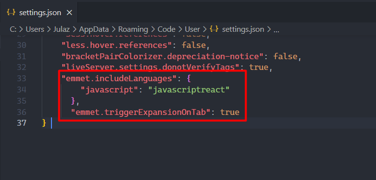

# Template de base pour app React

#### - Mise en place d'une architecture claire
#### - Mise en place d'une navigation
----------------------- 

# Start un projet React !

### Check si node et npm sont installé
 - ``node -v``  
 - ``npm -v``

Si les deux sont installé, créer l'app React :
- ``npx create-react-app nom-du-projet``
- ``cd nom-du-projet`` (se placer sur le projet créer)
- ``code .`` (permet de lancer l'app créé direct dans vsCode)

Pour utiliser le rooter taper cette commande
=> ``npm i react-router-dom sass``

Pour utiliser axios
=> ``npm i axios``

Puis importer dans votre fichier App.js :
``import { BrowserRouter, Routes, Route } from "react-router-dom";``

En cas de bug avec la commande ci-dessus, quelques commande pour le debug:
1. ``npm update``
2. ``npm audit fix``
3. ``npm start``

---------------------------
# Reprendre un projet React
1. ``npm i``

--------------------------
# Pour l'aide à la complétion
Ouvrire les settings de VsCode taper 'json' dans rechercher puis sélectionner 'Edit in settings.json' et ajouter les lignes de code encadrée.

## Pour comprendre le code React plus facilement via la console (Extension).
- React Developer Tools
